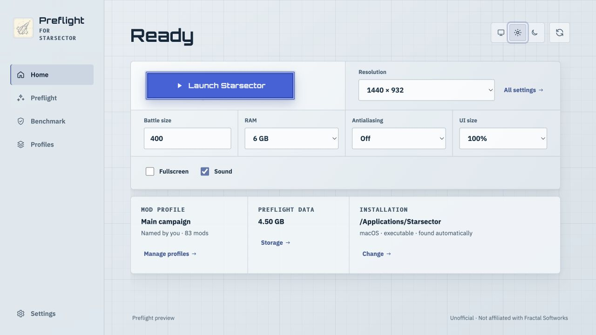
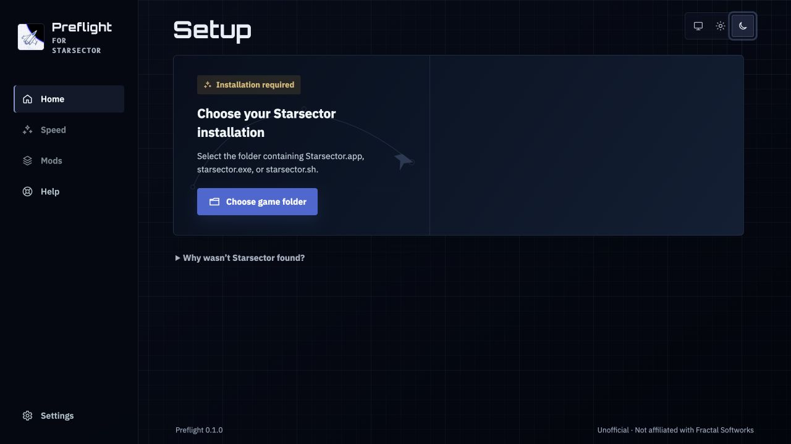
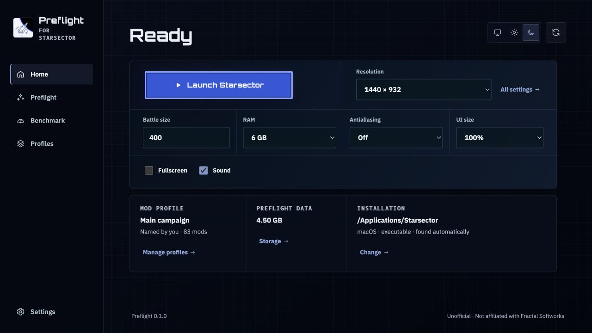
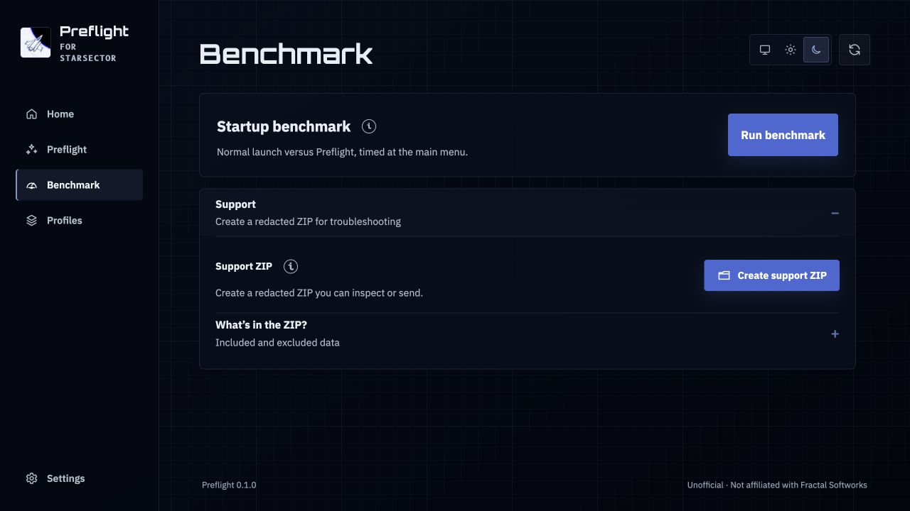
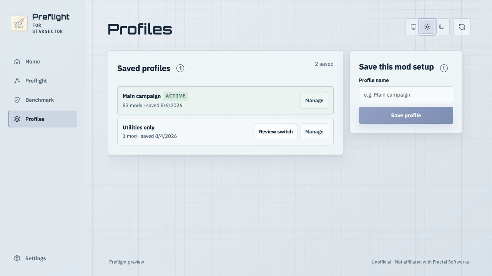

# Preflight

**A free, open-source cross-platform performance launcher and mod-analysis toolkit for Starsector. On my 83-mod development setup, startup moved from roughly 101 seconds to a 13.69-second best run.**

> Preflight is an independent, unofficial project. It isn't affiliated with or endorsed by Fractal
> Softworks.

> **Release candidate.** Source and rendered-UI convergence are complete. Public downloads follow
> maintainer authorization of one immutable candidate plus the remaining native/package evidence.
> Progress is tracked in [Release readiness](docs/release-readiness.md).

<picture>
  <source media="(prefers-color-scheme: dark)" srcset="docs/images/desktop-home-dark.png">
  
</picture>

Preflight started with a straightforward question: why did heavily modded Starsector repeat so much
work every launch? Profiling and bytecode-level investigation found repeated data parsing, a texture
cache on the wrong side of a single-threaded prefetch wait, rebuildable texture data made needlessly
durable, repeated generated-code compilation, and high-frequency campaign scans and recomputations.
Moving those costs to better boundaries produced the current development arc.

Preflight prepares repeatable texture, data, generated-code, and audio work ahead of launch, records
the game and ordered mod identity observed during preparation, and checks that identity again before
reuse. Runtime shortcuts are checked against the code they were reviewed against. If a change is
detected, prepared data is missing or damaged, or a target is unsupported or ambiguous, the original
game path remains available.

The same Java engine now powers a Windows/macOS/Linux desktop app with a React UI over a Rust/Tauri
host, a bundled Java runtime, durable launch/playtime history, named mod profiles, storage and
recovery tools, privacy-conscious diagnostics, signed updates with rollback, and source-side
analysis tools for large mod setups.

For the engineering story, start with [Engineering overview](docs/engineering-overview.md). For the
measurement chronology and experimental context, see [Optimization history](docs/optimization-history.md).

## A lot more than a launch button

- **Measure your own result.** The desktop benchmark runs the same setup twice through Preflight,
  first with reviewed optimizations off and then with them on,
  on the current installation. **Copy result** produces a compact shareable comparison without raw
  evidence, private paths, or logs.
- **Track Starsector playtime.** A local play-history ledger follows sessions launched through Preflight
  even if the desktop minimizes or exits afterward. **Copy playtime** shares total/session context,
  and the engine can export versioned JSON plus spreadsheet-safe CSV.
- **Keep named mod profiles.** Save, search, switch, rename, duplicate, and delete profiles. Switching
  previews the exact `enabled_mods.json` change and saves a backup first. Duplicating a profile does
  not duplicate mods, saves, or prepared data.
- **Put the launch settings you actually care about beside Launch.** Resolution, fullscreen, sound,
  antialiasing, UI scale, RAM, and battle size are available without a separate launcher ritual.
  Battle size can extend past the vanilla slider through a custom numeric value while still using
  Starsector's own `battleSize` preference.
- **Understand a giant mod setup without starting the game.** `preflight scan` inventories the
  enabled profile. The separate read-only deep setup check can report missing enabled mods, broken
  metadata, duplicate mod IDs, missing or disabled required dependencies, and resolved variants that
  point at hulls absent from the active profile.
- **Know the storage cost before writing.** Preflight calculates the current profile's finished and
  temporary requirements, reuses matching data, keeps a reserve, and offers a tiny minimal-disk
  route when the normal preparation does not fit.
- **Recover without guessing.** Preparation can stop safely, damaged prepared data can be repaired
  for the exact profile, cleanup is previewed before deletion, and failed runs offer **Copy setup**,
  Relaunch, and Get help directly from Home.
- **Share support data deliberately.** Copy setup can copy or save useful public facts without paths,
  credentials, saves, or arbitrary logs; saving creates a new text file and never replaces one.
  The separate support ZIP contains only the listed report details, shows its contents before
  sending, can be cancelled, and excludes game/mod assets, saves, screenshots, audio, caches,
  arbitrary logs, and credentials. Accepted reports carry retention/deletion information.
- **Update through a signed path.** The desktop can review a newer release, verify it, install it, and
  restart when asked. The release process also exercises install, upgrade, rollback, and removal
  across macOS, Windows, and Linux.
- **Inspect mods without editing them.** `preflight lint` reports measurable asset and configuration
  problems for one mod or a complete profile. It gives no score, changes no files, and can explain
  why each finding costs something.

The native desktop packages bring their own minimal Java runtime, so the desktop app does not ask you
to install a system JDK. The desktop host exposes a fixed set of typed commands rather than an
arbitrary shell. Every native package also carries a machine-readable capability receipt describing
the commands, writes, child processes, links, and network endpoints available to that exact package.

The normal path is still simple: open Preflight, let it find Starsector, press **Set up and launch**
once, then press **Launch Starsector** on later runs. The rest is there when you want it.

## The measured result

The current development headline is the observed arc: roughly 101 seconds at the early high end to a
13.69-second best observed run after the reviewed G1/deferred-heap-commit policy became the current
macOS Rosetta path. That is a development chronology, so the exact experimental context stays visible
below instead of pretending the endpoints came from one A/B session.

For the clean direct comparison, five ordinary launches had an 89.00-second median and five Preflight
launches had a 15.53-second median, with a 15.25-second low in that accelerated set. A later five-run
candidate condition measured a 14.04-second median and the 13.69-second best. Later same-machine
current-engine controls around 15.5 seconds show the remaining machine/run variance while confirming
that the reviewed JVM policy is still present in current code.

| Reference point | Main-menu time | Meaning |
| --- | ---: | --- |
| Observed early high | **~101s** | Highest launch observed on the development installation |
| Initial five-run baseline | **88.13s** | Median of five unaccelerated launches, on the earlier 77-mod profile |
| Earlier validated warm gate | **15.88s** | Previous production gate on the later 83-mod profile |
| Controlled baseline, one session | **89.00s** | Median of five vanilla launches, interleaved with the row below |
| Controlled result, one session | **15.53s** | Median of five Preflight launches in that same session |
| Lowest run in that controlled session | **15.25s** | Lowest of the five accelerated launches |
| Later reviewed JVM condition | 14.04s median | Five exact-marker runs with G1 and deferred heap commit |
| Best current development observation | **13.69s** | Best run in that later five-run condition |

The controlled 89.00/15.53 pair came from one 83-mod session. The order was shuffled inside every
round, the machine cooled for 240 seconds before each launch, and none of the ten runs were excluded.
The medians are **73.47 seconds** apart.

The later 13.69-second result used the same 83-mod M5 MacBook Air development profile and the log-marker
clock documented in the August 23 evidence. That evidence also records the current-engine control,
Compact physical-order work, and the difference between best-observed development timing and the
packaged candidate result still owed before release.

All of these development measurements are from one M5 MacBook Air running Starsector 0.98a-RC8 and
the game's bundled x86-64 Java runtime through Rosetta. Hardware, mods, storage, cache warmth,
memory pressure, translation, temperature, and other machine state affect the result. The historical
89.00/15.53-second pair used the game's launcher for its baseline and Preflight `--fast` for its
accelerated condition. The current built-in benchmark uses a different protocol: both launches run
through Preflight, with reviewed optimizations off and on. The development measurements and their
context are collected in [Optimization history](docs/optimization-history.md) and
[From three-minute preparation to fourteen-second launches](docs/evidence/2026-08-23-storage-to-fourteen-seconds.md).

Campaign play was measured separately. In one retained optimized 83-mod session, the first 30
seconds after loading averaged **46.10 FPS** with a **9.15 FPS one-percent low**. After that initial
catch-up, the remaining 4,091 campaign frames averaged **55.47 FPS** with a **20.45 FPS
one-percent low** — a **2.2×** increase in the one-percent low within that session. The two rows are
early and later slices of the same Preflight run, not an implementation A/B.
The frame-time distribution and route are retained in the [campaign engine report](docs/evidence/2026-08-05-campaign-engine-call-times.md).

The first public beta still needs its benchmark run against the exact accepted package bytes. That
packaged result will sit beside the development record instead of silently replacing it.

## Disk and preparation

Preflight calculates the requirement before writing anything. If the default does not fit, it can
offer **Prepare with minimal disk** instead.

| Mode | Immediately after preparation on this 83-mod profile | Observed preparation |
| --- | ---: | ---: |
| **Balanced** (fresh-profile bootstrap) | **2.3 GB** | 38.3s |
| **Compact** (automatic steady state) | **1.1 GB** | 17.3s after an observed launch |
| **Minimal disk** | **11 MB** | 5.1s |
| **Uncompressed** | **5.2 GB** | Not remeasured on the current preparation path |

Balanced briefly writes checked loose texture data while constructing its final 2.3 GB pack, then
removes the redundant copies after the pack opens successfully. The app therefore checks for more
free space than the finished cache occupies. After a successful first launch, Preflight learns the
texture access order and prepares Compact during a later idle window. Compact produced a
14.17-second startup pack while halving this profile's preparation time and finished texture data.
Actual costs depend on the artwork in the enabled mods, and the app calculates them for the current
profile. Minimal skips prepared textures while
keeping the other startup indexes and caches. Those caches continue learning on the first launch;
on this profile, Minimal grew from about 11 MB after preparation to about 204 MB after that launch.
The uncompressed option remains available as an advanced comparison and compatibility control. It
used about 2.9 GB more than Balanced here without improving the measured whole launch. The current
measurements and CLI controls are in
[Performance and storage tradeoffs](docs/performance-storage-tradeoffs.md).

Those preparation times came from one development session. The files were already warm in the OS
cache, while temperature, system load, and competing processes were not recorded. They show what
happened in that run rather than what another machine should expect.

## What Preflight actually does

- **Preparation.** Textures, merged data, generated mod bytecode, and audio are prepared under the
  exact game and ordered-mod profile that produced them.
- **Launch.** Recommended mode applies reviewed runtime shortcuts inside the child game JVM and
  tracks which adapters ran, declined, or failed.
- **Benchmark.** The permission-free desktop benchmark compares the same sealed installation and
  profile through Preflight with reviewed optimizations off and on, then retains one versioned result.
- **Playtime.** A bounded local play-history ledger totals how long Starsector remains open across launches that
  Preflight can observe. It continues recording when the desktop minimizes or exits after launch.
  The UI can copy a bounded summary and the engine can export versioned JSON or CSV.
- **Frame pacing.** Starsector keeps its own live FPS counter. An opt-in Preflight setting can also
  retain a bounded local session summary with average FPS, one-percent low, and p95/p99 frame times,
  then show the latest campaign and combat results with their measured frames and active time plus
  recording cost on Speed. A separate experimental smoothing switch keeps Starsector's own FPS cap
  but disables vsync to avoid doubled-frame presentation drops; it may show tearing. Neither option
  reads or writes campaign saves.
- **Profiles.** Named mod profiles retain their own identities and prepared data. Switching a profile
  previews the exact `enabled_mods.json` change and saves a backup. Saved profiles can be searched,
  renamed, duplicated, and deleted without copying mods, saves, or cache bytes.
- **Storage.** The desktop calculates the current build's disk requirement before writing, separates
  prepared data from evidence, and previews cleanup before anything is removed. Cleanup keeps the
  current and readable saved profiles reachable.
- **Game settings.** Resolution, fullscreen, sound, antialiasing, UI scale, RAM, and custom battle
  size are available beside the launch button.
- **Presentation.** Home can use the full Hangar view or a compact launch-first view. Recorded
  playtime visibility and decorative hull motion/direction are display-only preferences. Featured
  Hangar ships can be traced locally from installed hull/sprite data into Preflight's own wireframe
  rendering rather than bundling Starsector ship art.
- **Setup analysis.** A read-only deep pass checks mod metadata/dependencies and selected resolved
  static references without launching or changing the game.
- **Evidence and support.** Help can copy or save a bounded privacy-safe setup summary for a forum,
  Discord, or support conversation. A separate support ZIP contains disclosed allowlisted metadata and
  excludes saves, assets, screenshots, recordings, caches, arbitrary logs, and credentials.
- **Updates and package identity.** The desktop release path uses the project updater key for signed
  updates, and every package carries a machine-checked capability receipt describing the commands,
  writes, child processes, links, and network endpoints available to that exact package.
- **Analysis tools.** The CLI includes the profiler and measurement tools used during development,
  profile discovery/census/dry-run commands, deep setup analysis, and a read-only mod linter for
  measurable asset and configuration problems.

## From install to launch

On first open, Preflight searches the usual installation folders. If Starsector is not there, choose
the folder containing `Starsector.app`, `starsector.exe`, or `starsector.sh`.

The native desktop package includes its own minimal Preflight Java runtime. A system JDK is required
only for the standalone JAR/development path, not for ordinary desktop use.



Once the current mod profile is prepared, the home screen keeps the routine controls together. The
large button launches Starsector; resolution, battle size, RAM, antialiasing, UI scale, fullscreen,
and sound can be changed beside it.



The benchmark opens Starsector twice through Preflight—first with reviewed optimizations off, then
with them on—and shows the difference.
It does not need Accessibility permission or click through the game on your behalf.



## Compatibility and containment

Preflight does not rewrite game or mod JARs, executables, or assets. It does not directly edit
campaign saves or put prepared data into them; Starsector remains responsible for its normal save
writes. Prepared files live in Preflight's own data area and can be rebuilt. Runtime changes exist
only in the launched JVM and disappear when the game exits. Two explicit, backed-up features can
update game-owned preferences: profile activation and the launch-settings editor.

Prepared data is a disposable acceleration layer, not game state. Preflight checks the identity it
recorded, validates each prepared representation, and declines the prepared path when a check fails;
the game's original loader then handles that work. The current checks and their documented limit are
covered in the [cache and save-safety audit](docs/evidence/2026-08-25-cache-and-save-safety-audit.md).
The human campaign gate now binds the actual route and minimum measured play time as described in
the [gameplay route evidence boundary](docs/evidence/2026-08-26-gameplay-route-evidence-boundary.md).

| Situation | Result |
| --- | --- |
| A game or mod change is detected | Only matching prepared data is selected |
| A prepared entry is missing or invalid | The original loader handles that request |
| A reviewed class fingerprint changes | That runtime transformation declines |
| A campaign is saved | Prepared cache data is not part of the save payload |
| Preparation is interrupted | Completed immutable blobs remain reusable |
| The current build does not fit with its safety reserve | Preparation refuses before writing |
| Cleanup or removal is requested | Preflight shows the exact owned targets first |

Anything Preflight does not recognize continues through the game's original path. A future launcher
layout or game update can still require a Preflight update. The desktop native boundary is a fixed
set of typed commands, not a generic shell, and every packaged release records its available native
capabilities in the [capability receipt](docs/capability-receipt.md).

The full product boundary is in the [Product contract](docs/product-contract.md), with current
limitations in [Known limitations](docs/known-limitations.md).

## How this was developed

Yes. I used ChatGPT/Codex and Claude Code throughout development.

The repository includes the history of the experiments that were tried, including the ones that
failed. Some of those failures are more informative than the successes:

- early prepared-texture pilots had healthy hit counters while producing cropped, tiled, black, or
  displaced visuals;
- a supposed timing bimodality turned out to be a stale benchmark anchor;
- Java Flight Recorder's clock under one runtime setting ran about 2.49 times away from wall clock;
- a GraphicsLib replay expanded a roughly 0.25-second path to around 1.70 seconds and was removed;
- AppCDS did not establish a safe win for the shipped obfuscated classes and was removed too.

When stuff succeeded, I made sure it continued to succeed. When stuff failed, I figured out why and
made sure the same failure had a regression test or an explicit rejected record where that was
useful. The benchmark exists in the product partly because this project repeatedly demonstrated
that a convincing number can still be measuring the wrong thing.

Preflight checks installed code before applying an optimization. If it does not recognize something,
it leaves it alone. I tried to get the app itself to also be as performant as possible. This should
be better than Microsoft Teams.

Preflight does not directly edit campaign saves or put prepared data into them; Starsector still
owns normal save writes. Ordinary game launches upload no logs or telemetry. Support-report sending
is a separate disclosed action using the bounded ZIP shown in Help. The first beta does not send
failed-run reports automatically. This is still a beta. If you find a problem, please report it. I
will investigate.

Every package also carries a [machine-checked capability receipt](docs/capability-receipt.md) listing
the commands, writes, child processes, links, and network endpoints available to that exact package.

## Development quick start

Public packages are not available during the preview. Compile the self-contained CLI and Java agent
with JDK 17 and Maven 3.9 or newer:

```bash
./mvnw verify
```

The resulting launcher is `preflight-cli/target/preflight.jar`. Install the local launcher and
prepare the detected profile:

```bash
java -jar preflight-cli/target/preflight.jar install --prepare
```

Launch through the ordinary Starsector launcher path:

```bash
java -jar preflight-cli/target/preflight.jar run --optimization-preset recommended
```

Inspect discovery without launching the game:

```bash
java -jar preflight-cli/target/preflight.jar doctor
```

Inspect the resolved setup more deeply without launching or changing it:

```bash
java -jar preflight-cli/target/preflight.jar analyze setup
```

Print the exact selected launch command without starting Starsector:

```bash
java -jar preflight-cli/target/preflight.jar run --dry-run
```

Unattended launches can use Starsector's saved display and sound settings directly:

```bash
java -jar preflight-cli/target/preflight.jar run --direct \
  --optimization-preset recommended
```

The desktop app uses the same command engine and safety checks. Its development and packaging
instructions are in [preflight-desktop](preflight-desktop/README.md).

## Where the time went

The current performance story is easier to understand as a sequence of boundaries than as one
additive component ledger. The measurements below come from separate retained seams and development
campaigns. They are evidence for different changes, not numbers to sum into a synthetic total.

- **Shared data reads.** One measured launch issued **39,017 JSON calls across 8,378 distinct paths**.
  Five loader-specific caches exposed a lower common boundary, where repeated JSON/CSV work moved
  into a shared memoized read layer. `SpecStore` moved **19.8s → 9.8s**, and the remaining merged-read
  seam moved **2.172s → 0.300s**.
- **Texture critical path.** The loading thread could wait roughly **27 seconds** behind a
  single-threaded prefetch queue before the prepared-texture decision was consulted. Moving that
  decision ahead of the queue fixed the placement problem, and later upload work removed **1.22 GiB
  of VRAM padding**.
- **Texture publication and layout.** Rebuildable intermediates no longer receive per-file durability
  before one final pack is published. The retained preparation arc is **200.77s → 16.21s**, with
  storage **4.76 GB → ~1.1 GB**. On the same logical Compact corpus, observed startup order moved
  launch **33.53s → 14.174s** compared with alphabetical layout.
- **Generated code.** Memoizing **228 Janino compilation requests** moved the compiler seam
  **18.014s → 2.364s**. The persisted result then revealed **36,332 generated-class occurrences** but
  only **280 unique classes**, shrinking stored class maps **145.96 MiB → 1.13 MiB** and replay
  **1.501s → 29ms** after deduplication.
- **Campaign runtime.** Mutation-tracked indexes removed the expensive sector-wide validation work
  measured as **79.1M entity-reference checks → 0**, while a separate memoized path served
  **117.9M unchanged commodity calls** without inventing a universal FPS claim.

The callback-specific AshLib, GraphicsLib, audio, resource-resolution, and other intermediate wins
remain in the source-linked chronology rather than competing for equal weight here. See
[Engineering overview](docs/engineering-overview.md) for the design story,
[Optimization history](docs/optimization-history.md) for the measurement chronology, and the
[Experiment ledger](docs/experiment-ledger.md) for rejected and superseded paths.

## Storage choices

Fresh profiles start with Balanced. It keeps upload-ready texture pixels in LZ4 blocks when
compression saves meaningful space and retains raw storage where compression buys little. The
advanced Uncompressed option keeps every pixel array raw and trades disk space for less decode CPU.

Balanced is currently the fresh-profile bootstrap. After one successful observed launch, Compact
can retain the startup access set in about 1.1 GB on the development profile. It prepared in 17.25
seconds and launched in 14.17 seconds there, compared with about 2.3 GB and 38.33 seconds of cold
preparation for Balanced. After a successful observed launch, the desktop waits for an idle window
and graduates the profile to Compact automatically. The existing valid pack and original source
path remain available if that maintenance cannot finish.

On the 83-mod development profile, Balanced reduced the texture pack from 5.34 GB to 2.26 GB. Ten
fresh-JVM replays measured the exact startup access order at 1,137ms for Balanced and 691ms for
Uncompressed. Current pack-only retention leaves about **2.3 GB** for Balanced and **5.2 GB** for
Uncompressed on this profile. The exact replay seam improved by about 446ms, but Uncompressed did
not improve the measured whole launch. Compact is the normal learned steady state.

Preparation calculates decoded texture size, deduplication, reusable blobs, temporary packing, and
current filesystem space. It keeps at least 512 MiB in reserve and refuses before writing when the
current build does not fit. Existing manifests stay active until a new
preparation completes.

The [storage and startup chronology](docs/evidence/2026-08-23-storage-to-fourteen-seconds.md)
records how the earlier three-minute preparation path was corrected and why physical pack order
matters to the launch result.

```bash
java -jar preflight-cli/target/preflight.jar prepare --plan --json
java -jar preflight-cli/target/preflight.jar prepare --texture-storage balanced
java -jar preflight-cli/target/preflight.jar prepare --texture-storage fastest
java -jar preflight-cli/target/preflight.jar cache prune --json
```

The detailed disk model and safe pruning behavior are in
[Performance and storage tradeoffs](docs/performance-storage-tradeoffs.md).

## Profiles, diagnostics, and removal



Named profiles preserve ordered mod selections and let prepared data follow the setup it belongs to.
They can be searched, renamed, duplicated, switched, and deleted. A duplicate can be made before an
experiment without changing the active game profile or duplicating mods, saves, or prepared bytes.
The local play-history ledger can be exported as a versioned JSON document with an optional
spreadsheet-safe CSV view.

Diagnostics are managed independently from acceleration data. **Copy setup** and **Save setup
summary** produce the same compact privacy-safe text for ordinary support; Copy setup is also
available directly from failed-run recovery.
The separate ZIP export includes only allowlisted text metadata from recent runs and benchmarks,
with an in-ZIP disclosure that names every included or skipped file.

Removal has two scopes. Removing the launcher leaves Starsector and Preflight's reusable data in
place. Removing all Preflight data includes caches, profiles, retained evidence, and backups after a
target review. Neither scope includes Starsector, mods, saves, or game-owned settings.

See [Diagnostics export](docs/diagnostics.md), [Privacy](docs/privacy.md),
[Portable play-history export](docs/play-history-export.md), and
[Downloads and installation](docs/downloads.md) for the exact behavior.

## Before the public beta

Source and rendered-UI convergence are complete, and the private signing/package rehearsals have
succeeded across Linux, macOS, and Windows. The remaining beta gates establish the exact candidate
claim and native platform boundary:

1. The maintainer selects the accepted source and authorizes one immutable tagged candidate generation.
2. Exercise that frozen package on native Windows with a licensed Starsector installation.
3. Exercise the same frozen package on native x86-64 Linux with a licensed installation.
4. Collect package-bound startup, lifecycle/update, production-report, and identity evidence against
   that same generation.
5. Complete the hands-on packaged report-intake cancel/retry/delete canary.
6. Make the final public-release decision after the candidate evidence is retained.

Private rehearsals prove the release machinery; they do not authorize the release tag. The final
startup benchmark will use the engine extracted from the accepted package bytes and sit beside the
established development record above.

The complete publication checklist is in [Release readiness](docs/release-readiness.md). The ordered
product and evidence work is in the [Public beta roadmap](docs/beta-roadmap.md).

## Analysis and mod tools

The repository also contains the measurement tools used during the investigation: JFR recording,
startup-phase probes, loader attribution, unattended benchmark campaigns, crash detection, a profile
census, a deep read-only setup checker, and the mod linter. Normal accelerated launches do not
require profiling.

```bash
java -jar preflight-cli/target/preflight.jar lint
java -jar preflight-cli/target/preflight.jar lint --path ./MyMod
java -jar preflight-cli/target/preflight.jar analyze setup
```

The setup checker can flag deterministic active-profile problems such as missing or disabled required
dependencies, duplicate mod IDs, broken enabled-mod metadata, and winning variants that reference a
hull absent from the resolved profile. It does not launch or modify Starsector.

Across real profiles, the linter has found progressive JPEGs that decode about 8.75 times slower
through the game's ImageIO path, gigabytes of avoidable texture and audio allocation, shadowed
resources, extension mismatches, unused files, and configuration placed where the game never reads
it. Its thresholds were calibrated across 86 installed mod directories: the median was zero findings
and 44 of 86 were completely clean. It has no score or automatic fixer. See
[Asset lint](docs/asset-lint.md) for the checks and evidence.

## Documentation

- [Documentation map](docs/README.md)
- [Leo's release talking points](docs/leo-talking-points.md)
- [Public-writing sales inventory](docs/public-writing-sales-inventory.md)
- [Optimization history](docs/optimization-history.md)
- [Product contract](docs/product-contract.md)
- [Release readiness](docs/release-readiness.md)
- [Public beta roadmap](docs/beta-roadmap.md)
- [Experiment ledger](docs/experiment-ledger.md)
- [Performance and storage tradeoffs](docs/performance-storage-tradeoffs.md)
- [Automatic launch and discovery](docs/automatic-launch.md)
- [Repeated startup benchmark](docs/startup-benchmark.md)
- [Prior-art review](docs/prior-art-starsector-render.md)
- [Evidence archive](docs/evidence/)

## Support Preflight

Preflight is free and open source. If it saves you a pile of waiting, helps you manage a ridiculous
mod list, or you simply like this kind of obsessive work, you can
[support its development on Patreon](https://www.patreon.com/cw/teamleaderleo).

Support helps with testing hardware, hosting, release work, and the time that goes into maintaining
and extending the project. The application, source, features, and public support stay available to
everyone.

## License

[MIT](LICENSE). Starsector, Fast Rendering, and mod content remain the property of their respective
owners. The repository and release packages contain none of those assets. Preflight is an
independent, unofficial project and isn't affiliated with or endorsed by Fractal Softworks.
