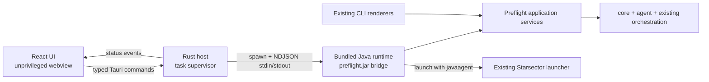

# Desktop app and distribution research

**Status:** recommendation for a bounded proof-of-concept, not an architecture decision  
**Researched:** 2026-07-28

## Recommendation

Build a real desktop edition with:

- **Tauri 2** for the window, native installer integration, signing hooks, and updater.
- **TypeScript + React** for the interface, using accessible headless components and a
  Preflight-specific visual system rather than a generic dashboard template.
- The existing **`preflight.jar` as the engine and Java agent**, shipped with a small `jlink`
  runtime. Users do not install Java.
- A narrow Rust process supervisor between the webview and Java. The frontend never receives
  arbitrary shell or unrestricted filesystem permissions.
- A structured event protocol and application-service layer shared by the CLI and desktop app.
  The finished UI must not scrape human-readable console output.

This is a better fit than rewriting the engine or placing a traditional settings GUI directly on
top of every CLI switch. It keeps Preflight's tested Java implementation intact while giving the
desktop edition first-class installers and updates.

The fallback is **JavaFX + AtlantaFX**, packaged with `jpackage` or Conveyor. That route has less
process-boundary work and stays almost entirely in Java, but gives up the strongest reason to add a
desktop app: a flexible, highly testable interface and a first-party cross-platform updater.

## What "native app" should mean here

Users should get an application that:

- launches from the Start menu, Applications, or their desktop environment;
- has an icon, native window chrome, file pickers, keyboard shortcuts, and dark-mode support;
- carries its own runtime and opens without a terminal;
- is signed so the operating system can identify its publisher;
- updates itself after the first install;
- leaves the expert CLI available, but never requires it for normal use.

It does not need three separately implemented platform UIs or platform-native controls throughout.
For this project, native installation, lifecycle, accessibility, and system integration matter more
than whether every button is drawn by WinUI, AppKit, or GTK.

## Why the Tauri-plus-Java shape fits Preflight

Preflight already has a small, self-contained engine artifact. The current shaded JAR is about
1.3 MiB. `jdeps` reports only these JDK modules:

```text
java.base,java.desktop,java.instrument,jdk.jfr
```

A local Apple Silicon JDK 21 `jlink` measurement using those modules produced a 49 MiB runtime
directory, or 30 MiB as a ZIP. This is a measurement, not a promised release size, but it shows that
bundling Java is practical. Tauri can include directory resources and external binaries, and uses
the system webview instead of bundling Chromium.

Tauri directly produces the formats we want:

- Windows: NSIS setup `.exe` and WiX `.msi`
- macOS: `.app` and `.dmg`
- Linux: AppImage, `.deb`, and `.rpm`

Its updater supports Windows, macOS, and Linux and requires signed update metadata. Its GitHub
Action supports a platform/architecture matrix and can generate updater metadata alongside release
artifacts.

The architectural cost is a Java process boundary. That cost is real, but it also creates useful
isolation: a failed scan or preparation task cannot corrupt the UI process, cancellation has an
explicit owner, and the GUI does not need privileged direct access to the whole filesystem.

## Candidate comparison

Scores are relative to this repository, where 5 is strongest.

| Option | Java reuse | UI ceiling | Installers | Updates | Testability | Maintenance | Verdict |
| --- | ---: | ---: | ---: | ---: | ---: | ---: | --- |
| Tauri + bundled Java | 4 | 5 | 5 | 5 | 5 | 3 | Recommended spike |
| JavaFX + Conveyor | 5 | 4 | 5 | 4 | 3 | 4 | Strong fallback |
| JavaFX + `jpackage` | 5 | 4 | 4 | 1 | 3 | 5 | Good app, incomplete delivery story |
| Compose Desktop | 5 | 4 | 4 | 1 | 3 | 3 | Adds Kotlin/Gradle; Linux accessibility gap |
| Electron + bundled Java | 4 | 5 | 5 | 4 | 5 | 2 | Chromium and security-update burden are unjustified |
| Flutter or Avalonia + Java | 2 | 4 | 4 | 2 | 4 | 2 | New ecosystem plus the same bridge problem |

### JavaFX

JavaFX is the simplest implementation fit. It works with Maven, can be styled deeply with CSS, and
`jpackage` creates self-contained `.exe`, `.msi`, `.dmg`, `.pkg`, `.deb`, and `.rpm` packages.
AtlantaFX supplies a modern MIT-licensed theme and additional controls.

The weakness is not visual quality; a deliberately designed JavaFX app can look excellent. The
weakness is distribution lifecycle. `jpackage` has no updater, packages must be built on their
target operating system, and Linux still needs an AppImage path if we want a portable single file.
Conveyor fills most of that gap and is free for open-source projects, but it is an additional vendor
tool rather than part of Java or this repository.

JavaFX remains the escape hatch if the Tauri/JRE bundle proves awkward to sign or maintain.

### Compose Multiplatform Desktop

Compose has a modern declarative UI and direct Java interop. Its native-distribution plugin uses
`jpackage` and emits DMG/MSI/DEB-style packages. It would, however, add Kotlin and Gradle to a Maven
Java repository without solving updates. JetBrains currently documents desktop accessibility as
fully supported on macOS, supported through Java Access Bridge on Windows, and unsupported on
Linux. That is a poor trade for this app.

### Electron

Electron has excellent UI tooling and established macOS/Windows updating. It also ships Chromium
and Node, requires frequent security-framework upgrades, and has no built-in Linux updater. Since a
Java runtime must still be bundled, Electron would give Preflight two large managed runtimes and the
widest maintenance surface.

### Flutter and Avalonia

Both can make polished cross-platform apps, but neither can consume the Java engine directly. They
therefore keep the IPC boundary while also introducing Dart or .NET and their packaging ecosystems.
There is no compensating advantage over Tauri for this project.

## Proposed architecture



### Keep the frontend unprivileged

Do not expose Tauri's general shell plugin or broad filesystem API to frontend code. Register a
small set of Rust commands such as:

```text
get_snapshot
select_installation
start_scan
start_prepare
start_game
cancel_task
list_runs
open_run_folder
```

Rust validates inputs, resolves the bundled runtime and JAR, owns each child process, and translates
structured engine events to Tauri events. The Java engine remains responsible for canonical-path
and installation safety rules.

### Do not turn console prose into an API

Add an application layer that returns records and emits typed progress:

```text
DiscoveryService
ProfileService
PreparationService
LaunchService
RunHistoryService

ProgressSink
CancellationToken
```

The CLI adapts those results to text or JSON. A new `bridge` entry point adapts them to newline-
delimited JSON. Logs go to stderr; stdout contains protocol objects only.

Each request and event carries a protocol version, request ID, operation, and stable machine code.
Human-readable messages are additional presentation data, not identifiers.

Example:

```json
{"protocol":1,"id":"8f2","method":"prepare","params":{"game":"/Games/Starsector"}}
{"protocol":1,"id":"8f2","event":"stage_started","stage":"resource_index"}
{"protocol":1,"id":"8f2","event":"stage_completed","stage":"resource_index","outcome":"cache_hit"}
{"protocol":1,"id":"8f2","result":{"outcome":"ready","report":"..."}}
```

Start with one Java process per foreground task. It is easier to recover, test, and cancel than a
resident daemon. A persistent engine should only be considered later if measurements show JVM
startup to be a usability problem.

### Task lifecycle

- At most one mutation-heavy task runs at once.
- Scans and preparation are visible, cancellable background tasks.
- Closing the window while a task runs asks whether to keep waiting or cancel.
- Launching Starsector may keep a lightweight task active until the game exits, but closing the
  Preflight window must not accidentally terminate the game.
- Updates never install while preparation or a game run is active.
- A UI or Java-engine crash leaves a bounded diagnostic record that the next launch can explain.

## Product shape

This should be a launcher and health surface, not a settings wall.

### Home

The initial view answers four questions:

1. Which Starsector installation will launch?
2. Is Preflight ready?
3. Is there useful preparation work to do?
4. What happened last time?

The dominant action is **Launch Starsector**. The installation is shown directly above it, with a
small **Change** action. A status line uses ordinary language:

```text
Ready to launch
82 enabled mods · caches current · last run completed normally
```

If preparation is worthwhile, show one contextual card:

```text
Faster repeat launches are available
Preflight can prepare 4.8 GB of textures without changing your game or mods.
[Prepare now]  [What this does]
```

Do not make users understand resource indexes, JFR, adapter target hashes, or manifest identities
before they can launch.

### Navigation

Use one stable left sidebar:

- **Home**
- **Profile** — enabled mods, workload, VRAM pressure, asset findings
- **Cache** — state, size, last build, prepare/rebuild/clear
- **Runs** — launch history, outcomes, comparisons, diagnostics
- **Labs** — experimental adapters and evidence-gated features

Settings and About belong in the application menu or a compact footer. Expert tools remain in the
CLI until a real user workflow justifies a GUI.

### Progressive disclosure

- Automatically discover the installation; ask only when discovery is ambiguous or fails.
- Use safe defaults and minimize persistent settings.
- Put task-specific controls next to the task rather than in a global preferences page.
- Keep experimental adapter controls in Labs, with their current evidence status and an explicit
  opt-in. Avoid unexplained feature flags.
- Show raw JSON, hashes, command lines, and full logs only in an expandable diagnostic panel.

### Progress and errors

- Use named stages for work whose duration cannot be estimated.
- Use determinate progress only when the denominator is real.
- Keep progress inline instead of opening modal progress windows.
- Provide Cancel for expensive work, and make cancellation semantics explicit.
- Every failure includes: what failed, what remained untouched, the likely next action, and
  **Copy diagnostics**.
- Never report a failed optimization as if Starsector itself is broken.

### Visual direction

Aim for a restrained game utility rather than a neon sci-fi control panel:

- native title bar and menus;
- dark and light themes that follow the system;
- one restrained accent color;
- strong typography, spacing, and hierarchy;
- cards only where they group a real state or action;
- no icon-only commands for important actions;
- motion used for continuity and progress, with reduced-motion support;
- color never used as the only status signal.

The interface should be responsive down to a modest laptop window, but it does not need to behave
like a phone app.

### Accessibility acceptance

- Full keyboard operation with a visible focus indicator.
- Logical focus order and no keyboard traps.
- Proper names, roles, values, headings, and live status announcements.
- Text zoom and OS scaling without clipped controls.
- WCAG 2.2 AA contrast for default and high-contrast themes.
- Target sizes large enough for imprecise pointing.
- Screen-reader smoke tests with Narrator or NVDA, VoiceOver, and Orca.
- Never encode ready/warning/failure using color alone.

## Distribution plan

GitHub Releases can remain the artifact store. It should stop being the user journey.

Create a small download page with OS and architecture detection:

```text
Starsector Preflight
Make heavily modded Starsector launches easier to understand and prepare.

[Download for Windows]
Windows 10/11 · x64 · includes everything

macOS and Linux downloads
```

The primary button links directly to a stable redirect such as `/download/windows`, not to a
release page. The page should also state the publisher, current version, file size, and support
link. Advanced users can reach checksums and all artifacts from a secondary link.

### Windows

Primary:

- signed, per-user NSIS `Starsector-Preflight-Setup.exe`;
- Start menu entry and uninstaller;
- no administrator prompt unless a future feature truly requires it;
- an embedded or offline WebView2 bootstrap path so installation does not fail on a disconnected
  machine.

Secondary:

- `.msi` for managed deployments;
- WinGet manifest after stable versioning;
- Microsoft Store later, if its packaging and policy work with launching an external game.

Signing is not optional for a friendly Windows experience. Microsoft documents that unsigned
downloads have to build reputation from zero for every version, while a consistent trusted
publisher identity can carry reputation. Even newly signed binaries may initially receive a
SmartScreen warning; the Store is the only documented way to avoid that class of download warning
entirely.

### macOS

- separate Apple Silicon and Intel builds initially;
- signed and notarized DMGs;
- conventional drag-to-Applications layout;
- stapled notarization ticket and CI verification with `codesign`, `spctl`, and `stapler`;
- Homebrew Cask after stable URLs exist.

A universal build would be pleasant, but should not block the first release. The bundled JVM and
other native components make two architecture-specific artifacts straightforward and a universal
artifact something to prove rather than assume.

Do not target the Mac App Store first. Preflight needs to inspect arbitrary game folders, launch an
existing application, and pass a process-local environment to it. Direct Developer ID distribution
fits that behavior without fighting App Sandbox.

### Linux

Primary:

- AppImage for one-file portability;
- `.deb` for the common double-click installer experience on Debian/Ubuntu-family systems.

Secondary:

- `.rpm`;
- package-manager repositories if update volume justifies them.

An AppImage still has a first-run executable-bit rough edge on some desktops. The download page
should offer `.deb` as the obvious Ubuntu/Debian choice, with AppImage as the portable choice.

Do not begin with Flatpak. Preflight needs broad access to a user-selected game installation and
must launch a host application with controlled environment changes. Making that work through a
sandbox would either create confusing portal behavior or demand very broad permissions.

### Updates

- Check after the home screen becomes usable, not before the first paint.
- Download in the background only with clear user consent.
- Show release notes and offer **Restart to update**.
- Defer installation while a game or preparation task is active.
- Keep signed update metadata separate from operating-system code signing.
- Preserve one previous package in the release pipeline for rollback testing.

## Release engineering

Replace the single Ubuntu distribution job with a build matrix:

```text
Windows x64
macOS arm64
macOS x64
Linux x64
```

Each job:

1. builds and verifies the Maven reactor;
2. creates the platform `jlink` runtime;
3. builds the frontend and Tauri host;
4. packages the platform artifacts;
5. smoke-tests the unpackaged application;
6. signs the app and installer where credentials are configured;
7. uploads artifacts, signatures, updater metadata, and checksums.

A final release job assembles `latest.json`, verifies every expected architecture, publishes the
release, and updates the stable download redirects. Keep the runnable JAR as a supported expert
download.

Release signing needs:

- a Windows Authenticode identity kept stable between versions;
- Apple Developer ID Application credentials and notarization credentials;
- a separately backed-up Tauri updater private key;
- branch/environment protections around jobs that can access signing material.

## Proof spike before committing

Build the smallest end-to-end slice on all three operating systems:

1. A Tauri window with native title bar, system theme, one installation card, and one action.
2. A platform `jlink` runtime plus the current `preflight.jar` bundled as resources.
3. A Rust command that starts the bundled Java executable and returns a structured `doctor`
   snapshot.
4. A streamed fake or real scan with stage events and cancellation.
5. Unsigned NSIS EXE, DMG, AppImage, and DEB artifacts built in CI.
6. An updater artifact and local static update feed.
7. Keyboard-only and screen-reader inspection of the single screen.

The spike passes only if:

- it works on a machine with no Java installed;
- no terminal window flashes on Windows;
- paths containing spaces and non-ASCII characters work;
- the macOS app bundle can be signed and notarized with the nested runtime;
- the game process can outlive the UI without becoming orphaned incorrectly;
- cancellation and crash recovery produce honest final task states;
- packaged UI automation runs on Windows, macOS, and Linux;
- measured startup, download size, idle memory, and update size are acceptable.

The nested-runtime signing/notarization check is the main go/no-go item. If it fails or produces an
unreasonable maintenance burden, switch the shell to JavaFX and retain the same application-service
and UX plan.

## Suggested phases

### Phase 0 — architecture seam

- Define application-service records, progress events, cancellation, and stable error codes.
- Adapt `doctor` and `scan` first.
- Preserve existing CLI behavior with regression tests.

### Phase 1 — useful desktop alpha

- Discovery and installation picker.
- Home readiness state.
- Profile scan.
- Normal game launch.
- Run history and open-diagnostics action.
- Unsigned development packages on all platforms.

### Phase 2 — preparation and polish

- Preparation task with stage progress and cancellation.
- Cache state and safe cache deletion.
- VRAM and asset findings with plain-language recommendations.
- Dark/light/high-contrast review and screen-reader testing.

### Phase 3 — delivery

- Windows signing.
- Apple signing and notarization.
- Tauri signed updater feed.
- Public download page with stable OS-specific links.
- WinGet and Homebrew Cask submissions.

### Phase 4 — ambitious features

- Rich run comparison and startup timelines.
- Diagnostic bundle export.
- Deep links from documentation into the app.
- Microsoft Store evaluation.
- Optional community localization.

## Sources

Primary documentation used for this review:

- [Tauri distribution overview](https://v2.tauri.app/distribute/)
- [Tauri external binaries](https://v2.tauri.app/develop/sidecar/)
- [Tauri bundled resources](https://v2.tauri.app/develop/resources/)
- [Tauri updater](https://v2.tauri.app/plugin/updater/)
- [Tauri Windows installers](https://v2.tauri.app/distribute/windows-installer/)
- [Tauri GitHub Actions pipeline](https://v2.tauri.app/distribute/pipelines/github/)
- [Tauri WebDriver testing](https://v2.tauri.app/develop/tests/webdriver/)
- [Oracle `jpackage` packaging overview](https://docs.oracle.com/en/java/javase/25/jpackage/packaging-overview.html)
- [OpenJFX Maven and runtime-image documentation](https://openjfx.io/openjfx-docs/)
- [Compose Multiplatform native distributions](https://kotlinlang.org/docs/multiplatform/compose-native-distribution.html)
- [Compose Desktop accessibility status](https://kotlinlang.org/docs/multiplatform/compose-desktop-accessibility.html)
- [Electron distribution overview](https://www.electronjs.org/docs/latest/tutorial/distribution-overview)
- [Electron updater support](https://www.electronjs.org/docs/latest/api/auto-updater/)
- [AtlantaFX project](https://github.com/mkpaz/atlantafx)
- [Conveyor JVM packaging](https://conveyor.hydraulic.dev/9.0/)
- [Microsoft SmartScreen reputation guidance](https://learn.microsoft.com/en-us/windows/apps/package-and-deploy/smartscreen-reputation)
- [Microsoft WinGet submission guidance](https://learn.microsoft.com/en-us/windows/package-manager/package/repository)
- [Apple Developer ID distribution](https://developer.apple.com/developer-id/)
- [Apple notarization requirements](https://developer.apple.com/documentation/security/notarizing-macos-software-before-distribution)
- [AppImage concepts](https://docs.appimage.org/introduction/concepts.html)
- [Homebrew Cask cookbook](https://docs.brew.sh/Cask-Cookbook)
- [Apple settings guidance](https://developer.apple.com/design/human-interface-guidelines/settings)
- [Windows design guidelines](https://learn.microsoft.com/en-us/windows/apps/design/guidelines-overview)
- [GNOME progress guidance](https://developer.gnome.org/hig/patterns/feedback/progress-bars.html)
- [WCAG 2.2](https://www.w3.org/TR/WCAG22/)
