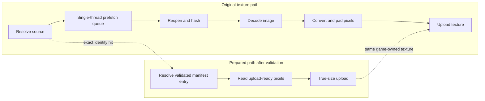
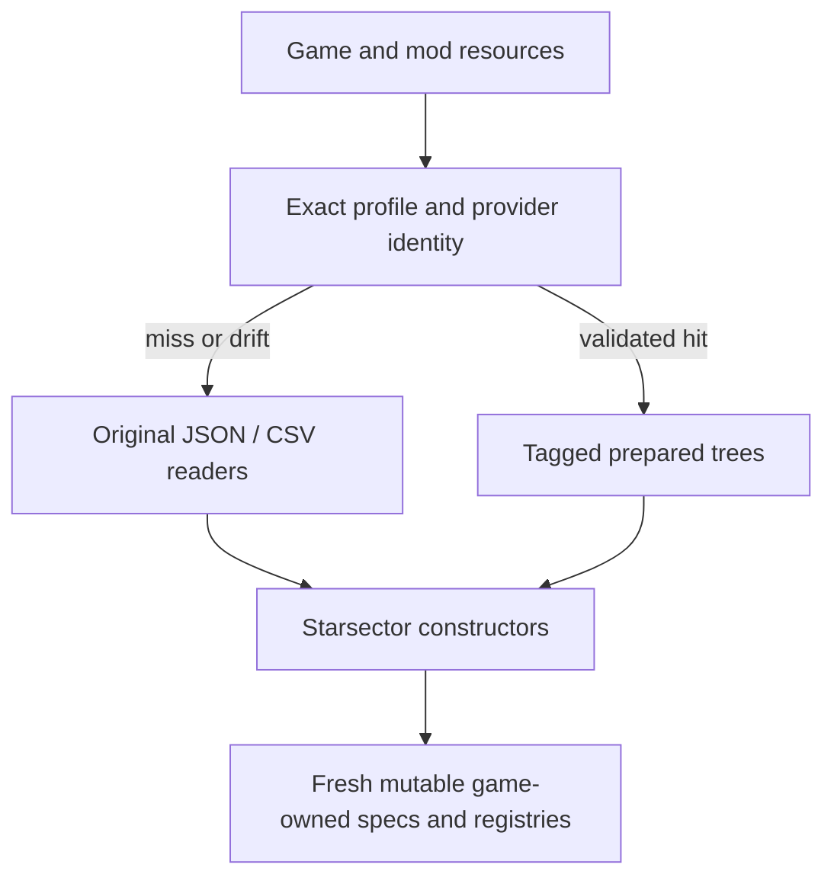

# From 88 seconds to 15.88: what changed in Starsector's loading path

**Status:** publication spine; performance claims link to retained evidence

**Profile:** Starsector 0.98a-RC8, 83 mods, M5 MacBook Air, bundled x86-64 Zulu 17 under Rosetta

**Updated:** 2026-08-07

On the 83-mod test installation, a normal launch initially took about 88 seconds. The fastest warm
launch recorded so far takes 15.88 seconds. That comparison is useful as a description of the work,
but it isn't a controlled claim that every installation will become 5.5 times faster. The two
endpoints were recorded at different stages of a long investigation, and the later number is a
record rather than a median.

The strongest causal result for the complete stack is a randomized fifteen-launch comparison made
partway through the work: five vanilla launches, five texture-only launches, and five launches with
the then-current complete stack. Vanilla measured 80.09 seconds and the complete stack measured
42.36 seconds, with every round agreeing on the effect within 1.9 seconds. The full design and raw
results are in [the whole-stack comparison](evidence/2026-08-03-the-whole-stack-measured-at-once.md).
Everything after that comparison is supported by narrower replays, component timings, integration
gates, and chronological launch records rather than a single final A/B cohort.

This document tells the technical story without pretending that every experiment succeeded or that
every adjacent launch was comparable. The [experiment ledger](experiment-ledger.md) records the
accepted, rejected, diagnostic, and deferred branches in a more compact form, while the
[performance and storage reference](performance-storage-tradeoffs.md) collects the choices that a
user will eventually see in the app.

## Reading the numbers

The benchmark became part of the engineering work because several early measurements were wrong in
ways that looked convincing. Direct launch removed human launcher latency, the main-menu state and
game log replaced guessed visual gaps, and unattended shutdown made repeated cohorts practical. A
supposed 18-second bimodality later turned out to be a stale benchmark anchor rather than a property
of the game, while Java Flight Recorder's clock under `UseFastUnorderedTimeStamps` ran about 2.49
times off the wall clock. Both errors are preserved in [the harness diagnosis](evidence/2026-08-01-the-bimodality-was-the-anchor.md)
and [the profiler correction](evidence/2026-08-02-what-the-profiler-was-not-telling-us.md).

As a result, a game-log-to-main-menu duration and a wrapper wall time are treated as different
metrics, and a profiled launch isn't compared directly with an ordinary launch. Replays can
establish a narrow CPU or I/O effect, but only a real launch can establish integration and visual
correctness. Whole-launch noise on the test machine is roughly ±1.4 seconds, so isolated
sub-second changes need controlled replays or larger cohorts. Browser activity, memory pressure,
ambient temperature, and back-to-back thermal throttling are recorded rather than quietly
normalized away. The current harness and condition definitions are documented in
[startup-benchmark.md](startup-benchmark.md).

The chronology begins at 88.13 seconds, although 62.60 seconds became the first accepted waypoint
after the initial texture campaign. Later gates should be read as the order in which improvements
entered the working stack, not as an additive decomposition of the original launch.

| Accepted gate | Main-menu time |
| --- | ---: |
| Initial controlled vanilla launch | 88.13s |
| Prepared-texture composition | 62.60s |
| Preparation moved before launch | 34.66 / 35.54s |
| Merged-read cache | 33.42 / 34.15s |
| Profile-stable startup JSON, five-run median | 29.61s |
| Deduplicated Janino pack, five-run median | 25.58s |
| Prepared-audio path index, three-run median | 24.76s |
| Resource-priority and WebP-tail work | 23.68s, then 23.03s |
| Collapsed texture/loading pipeline | 18.01 / 18.04s |
| Loading-screen redraw and title-tail work | 17.09 / 16.68s, then 16.21s |
| Current production gates | 16.66 / 16.28 / **15.88s** |

The 15.88-second run retained 42/42 transformed-class cache hits, 15,469 prepared-texture and
pixel-conversion hits, active adapter health, and no adapter decline or failure. Its exact record is
in [the lazy fleet-member report](evidence/2026-08-06-codex-lazy-fleet-members.md). A controlled
release-candidate cohort is still required before a public median replaces the current record.

## The first texture cache accelerated the wrong part of the wait

Texture preparation was the first substantial target because image decoding and conversion
occupied a large part of the loading profile. The initial prepared-pixel implementation did remove
that work, but the complete launch improved by only about 1.5 percent. That result didn't match the
amount of computation apparently being avoided, so the investigation moved outward from the image
decoder to the way loading was scheduled.

The loading thread was spending roughly 27 seconds waiting behind a single-threaded image prefetch
queue. A cache lookup placed after that queue could make an individual decode cheap while leaving
the main thread blocked on the same serialized work. Moving the prepared lookup ahead of the queue
changed the shape of the result, and combining the two independently useful bypasses brought the
controlled comparison from 88.13 seconds to 62.60 seconds. The queue behavior is shown in
[the prefetcher report](evidence/2026-08-01-the-loading-thread-waits-on-a-one-thread-prefetcher.md),
and the composed comparison is retained in
[the 29 percent result](evidence/2026-08-01-twenty-nine-percent-when-they-compose.md).

That larger win didn't make prepared pixels safe automatically. Several prototypes produced healthy
hit counters while cropping, tiling, blacking out, or displacing the title screen. A dimension-only
contract was insufficient; preserving only half of the original layout invariant could crash the
launcher; and a mutable comparison cache made a visually correct run fail its own acceptance test.
The sequence of failures begins with [the live pilot failure](evidence/2026-07-22-prepared-pixel-live-pilot-failure.md),
continues through [the visual-corruption report](evidence/2026-07-22-prepared-pixel-dimension-replay-visual-corruption.md),
and ends with [the corrected gameplay smoke pass](evidence/2026-07-23-prepared-pixel-gameplay-smoke-pass.md).
Those reports are part of the history because the eventual speedup depends on the stronger invariant
they forced the cache to preserve.

Once the path was correct, the remaining costs could be removed separately. Source hashing stopped
consuming about 6.68 seconds of CPU, decode and pixel conversion removed about 9.65 seconds, and
true-size allocation eliminated 1.22 GiB of padding that the shaders never sampled. The padding
result is measured in [the true-size upload report](evidence/2026-08-02-the-padding-is-gone.md),
while [the texture pipeline decomposition](evidence/2026-07-26-texture-load-pipeline-decomposition.md)
shows why these costs had to be treated as different stages rather than a single “image loading”
block.

The prepared store was refined again near the end of the campaign. Lazy texture carriers avoided a
2.116 GB compatibility-raster allocation, reducing 15,470 potential raster materializations to one;
validated index snapshots stopped repeating launch work; packed storage preserved the learned
access order; and a final lossless WebP miss removed about 1.27 seconds of blocked prefetch wait.
These changes are documented in [the lazy-carrier report](evidence/2026-08-06-lazy-texture-carriers.md),
[the validated-index report](evidence/2026-08-06-validated-texture-index-snapshot.md),
[the packed-store report](evidence/2026-08-06-packed-texture-store.md), and
[the WebP-tail report](evidence/2026-08-05-webp-prefetch-tail.md).

## The 0 percent plateau was stable data being rebuilt as text

After textures became cheaper, the loading screen remained at 0 percent for roughly 18 to 20
seconds. This was mostly vanilla `SpecStore`, which rebuilt variants, weapons, projectiles, hulls,
rules, factions, and related registries for every process. An early focus on the shared spec reader
could explain only about half a second, so optimizing it alone couldn't account for the visible
pause. The broader attribution is established in
[the SpecStore plateau report](evidence/2026-08-02-zero-percent-is-spec-store.md).

The important boundary was between stable inputs and mutable game objects. Preflight doesn't retain
the live hull, weapon, or rule objects from an earlier process. It stores tagged JSON and CSV trees,
or merged-reader results, underneath the ordinary constructors; Starsector still creates and owns
the runtime objects each time. Exact profile and provider identities decide whether a prepared tree
can be used, and a miss returns to the original reader.

The component replays show how much work had been hidden behind the single label: variants fell
from 3.289 seconds to 0.324, weapons from 3.338 to 0.998, projectiles from 2.349 to 1.004, hulls
from 2.653 to 0.754, and rules from 0.959 to 0.166. Duplicate rule registration was also changed
from a linear search to a set for 21,059 registrations, while repeated rule-token shapes and fixed
regex work were memoized without retaining live rule objects. The main progression is recorded in
[the plateau report](evidence/2026-08-02-zero-percent-is-spec-store.md),
[the tagged-spec fidelity report](evidence/2026-08-04-tagged-spec-json.md), and
[the core spec, faction, and rules follow-up](evidence/2026-08-05-core-spec-faction-and-rules.md).

The general merged-reader cache sits below the four corpus-specific caches rather than competing
with them, so it catches their misses and rehydrates tagged trees instead of reparsing text. Its
exact seam fell from 1.87 seconds to a much smaller rehydration path, and the first integrated
launches reached 33.42 and 34.15 seconds. Because the cache identity reuses hashes that the wrapper
already needs, profile hashing was memoized at the same time; otherwise the new correctness checks
would have returned 150–250 milliseconds of previously removed preparation work. The implementation
and installed `json.jar` fidelity gate are covered by
[the merged-read launch](evidence/2026-08-04-merged-read-cache-launch.md) and
[the tagged-tree fidelity replay](evidence/2026-08-03-merged-read-json-fidelity.md).

## Once vanilla loading became cheap, mod callbacks became visible

The tail after core loading was dominated by code that had always been present but had previously
been hidden beneath larger waits. AshLib repeatedly resolved hull and variant JSON during repository
population, accounting for a component reduction of roughly 7.1 to 7.4 seconds after its stable
inputs were reused. GraphicsLib regenerated or revalidated normal-map state, revisited hot settings,
and created objects that were uploaded only to be unloaded. Each optimization was pinned to an exact
reviewed class, source archive, loader, method descriptor, and input identity, so a changed mod can
decline the shortcut without disabling the mod itself. The accepted boundaries are described in
[the AshLib cache report](evidence/2026-08-02-ashlib-startup-json-cache.md),
[the GraphicsLib compact replay](evidence/2026-08-02-graphicslib-compact-autogen-replay.md), and
[the lazy generated-normal report](evidence/2026-08-05-graphicslib-lazy-generated-normals.md).

Janino presented a different kind of repetition. Mods were asking it to generate identical complete
class maps, and the early cache stored hundreds of bundles that repeated most of the same bytecode.
A complete-map cache reduced an 18.014-second direct aggregate to 2.364 seconds and removed about
5.37 seconds from the first whole-launch pilot. Packing the maps by content then shrank roughly
145.96 MiB to 1.13 MiB, while the warm read seam fell from about 1.5 seconds to 29–38 milliseconds.
The live gate and deduplicated representation are in
[the Janino pilot](evidence/2026-08-04-janino-bytecode-live-pilot.md) and
[the deduplicated-pack report](evidence/2026-08-05-janino-deduplicated-pack.md).

Not every plausible mod shortcut survived validation. Replaying GraphicsLib's public mapping
traversal grew a roughly 0.25-second path to about 1.70 seconds and required a 4.19 MiB artifact, so
the adapter and artifact were deleted. AppCDS couldn't establish a safe win for the shipped
obfuscated classes and was also removed. These are not “future optimizations” waiting to be switched
on; they are rejected branches documented in
[the traversal replay decision](evidence/2026-08-06-graphicslib-traversal-replay-rejected.md) and
[the AppCDS gate](evidence/2026-08-06-appcds-obfuscated-class-gate.md).

## Audio was expensive CPU work, but not always launch-critical work

The game constructs about 1.2 GB of decoded PCM before the main menu, which initially made audio
look like an obvious wall-time target. A closer trace showed that the loading thread didn't always
wait for all of that decode work, and the first equivalence harness had tested a decoder API that
the game never called. That correction matters: removing CPU time can reduce heat and later
contention on a fanless machine without producing the same number of seconds in the current launch.
The distinction is developed in
[the PCM census](evidence/2026-07-29-the-game-builds-1-2-gb-of-pcm-before-the-main-menu.md),
[the wait analysis](evidence/2026-07-30-the-loading-thread-never-waits-for-the-audio.md), and
[the invalid API gate](evidence/2026-07-26-the-audio-gate-decodes-an-api-the-game-never-calls.md).

The accepted path stores exact decoder-identified PCM, indexes it by source path, and reaches OpenAL
without redundant heap copies. A representative gate served 2,049 of 2,050 paths directly and used
one hash fallback. Earlier stages removed 19.7 core-seconds of Vorbis work and a measured 3.46-second
main-thread wait; the direct path later removed 133.3 MB of Rosetta hashing. The 24.76-second
three-run launch cohort was encouraging but wasn't a shuffled causal A/B, so it remains a
chronological gate rather than a promised audio-only saving. See
[the path-index report](evidence/2026-08-05-prepared-audio-path-index.md) and
[the direct-read report](evidence/2026-08-06-prepared-audio-direct-read.md).

Audio also exposed the value of behavioral pilots. An OpenAL error from an earlier operation was
being checked after a new stream source was created, and several experimental cache combinations
produced audible pops when entering or leaving simulation. The stale-error safeguard remained;
changes implicated in the pops were removed until repeated pilots reported no pop. The retained
correctness fix is documented in
[the OpenAL report](evidence/2026-08-05-openal-stream-source-stale-error.md).

## The last seconds were many small serial costs

By the time launches were around 24 seconds, no remaining component resembled the original texture
or SpecStore blocks. Ordinary startup still inventoried 2,612 game classes even though only a small
set could match a transform; exact targeting reduced that to 38 parsed classes, a 98.5 percent
reduction. Resource reprioritization fell from 558.257 milliseconds to 4.148 milliseconds, shared
resource-path normalization became 6.88 times faster, and the common `LoadingUtils` reader fell from
761.978 to 276.073 milliseconds while avoiding roughly 1.3 GB of scratch allocation. These results
are in [the exact-target report](evidence/2026-08-05-exact-target-transformer.md),
[the resource-priority report](evidence/2026-08-05-resource-priority-index.md), and
[the shared-reader report](evidence/2026-08-06-loading-utils-reader.md).

Other changes were smaller but repeatable: fixed path regexes improved by 3.48 to 8.51 times,
smart-quote normalization by 4.02 times, a packed LZ4 range needed one positioned read instead of
two, and file-only logging avoided about 249 milliseconds without changing the game log. Wrapper
profile selection moved independent identities onto a bounded pool for roughly 130 milliseconds,
while preparation overlap reduced two repeated preparation samples by about nine percent. The pool
is deliberately bounded and retains a serial kill switch because saving wall time by creating
unbounded CPU, memory, or I/O pressure would be a poor trade on constrained machines.

The title screen introduced its own temptation. Persisting save-descriptor results across launches
appeared to remove roughly half a second, but it exposed a GraphicsLib race and a two-minute cleanup
storm, so cross-launch persistence was rejected. Only a safe, same-JVM second-call memo remains.
Similarly, parsing an entire 103 MB save to pre-index references took about 685 milliseconds and
didn't address the actual save-load bottleneck, so neither a binary save cache nor a reference
pre-scan entered the product. The accepted title behavior is in
[the save-descriptor report](evidence/2026-08-06-main-menu-save-descriptor-memo.md); the save diagnosis
is retained in [the save-loading report](evidence/2026-08-02-save-loading-is-not-parsing.md).

The final chronological reductions came from collapsing adapter transformation passes, preserving
learned packed-texture order across storage policies, reducing loading-screen redraw cadence, and
deferring a few synthetic objects until they were actually consumed. These are individually narrow
changes whose main value is that they remove serial work without weakening the cache boundary. The
production gates moved through 18.01/18.04, 17.09/16.68, 16.21, and finally
16.66/16.28/15.88 seconds.

## Startup work led to campaign and combat work

Faster startup made live campaign and combat profiling tolerable, but the resulting optimizations
shouldn't be folded into the 15.88-second claim. A failed `getEntityById` lookup could scan the
entire sector and consume about 1.486 milliseconds, nearly nine percent of a 16.67-millisecond
60-FPS frame. A mutation-generation index made the synthetic mutation benchmark 36.5 to 40.8 times
faster, and a clean pilot served 10,478 positive plus 219,447 negative lookups with 229,924 fast
validations and no deep validations. The mechanism and live counters are in
[the failed-lookup report](evidence/2026-08-02-a-failed-lookup-scans-the-sector.md).

A commodity event-mod path proved even more repetitive: an early pilot observed 16.17 million
calls with a 98.78 percent cache-hit rate, and a later sample observed 129.03 million calls with a
99.8269 percent hit rate. Deployment icon scans, campaign radar type construction, GraphicsLib hot
settings, AI Tweaks range calculations, and several optional-mod paths were treated in the same way:
first identify an exact repeated question, then retain only a result whose invalidation can be
stated and tested. The commodity work is documented in
[the event-mod report](evidence/2026-08-05-commodity-event-mod-campaign-hotspot.md), with other entry
points in [the deployment scan](evidence/2026-08-04-deployment-member-icon-scan.md),
[the radar set](evidence/2026-08-05-campaign-radar-type-set.md), and
[the GraphicsLib settings report](evidence/2026-08-05-graphicslib-hot-settings-cache.md).

Frame telemetry now reports average and median FPS, 1 percent and 0.1 percent lows, and the share of
frames meeting 60- and 30-FPS budgets. One early mixed sample measured 53.4 average FPS, 59.17
median, 15.04 at the 1 percent low, and 6.78 at the 0.1 percent low; only 45.64 percent of frames met
the 60-FPS budget, even though 96.32 percent met 30 FPS. That sample also revealed title-demo and
campaign-warm-up contamination, so later reports split those phases rather than claiming a single
number for “gameplay.” The metric contract is in
[the FPS report](evidence/2026-08-05-frame-time-fps-reporting.md).

Several apparent performance problems were correctness defects instead. Stale mod simulation
opponents reached vanilla as invalid fleet members, a full-retreat race could end in an incompatible
combat cast, startup became fast enough to expose notification and fuel calculations running before
their state was ready, and the macOS memory warning interpreted free pages too literally. The
adapters added for these cases either validate and fall through or decline entirely when their exact
target drifts. They improve the experience, but they are reported as safeguards rather than as
startup acceleration.

## What the disk buys

Most of the speed comes from moving stable work out of the launch, which necessarily creates
artifacts. The Balanced texture policy uses a 2.259 GB hybrid raw/LZ4 pack on this profile, while
Fastest uses about 5.338 GB of raw upload-ready pixels. In an exact learned-order replay, Fastest
reduced the prepared-texture read seam from 1,137 to 691 milliseconds, about 446 milliseconds, at a
cost of roughly 3.08 GB. Balanced remains the default because the larger store buys a narrow seam
improvement rather than several seconds of launch time.

Prepared audio occupies about 1.1 GB because decoded PCM is effectively incompressible. The honest
alternatives are to prepare fewer sounds or decode them during each launch. Generated bytecode is a
rarer case in which the later representation became both faster and smaller: deduplication reduced
the live Janino pack to roughly 1.13 MiB, and pruning can remove old complete-map bundles once their
contents are proved present in the pack.

The cache also retains redundancy deliberately. Loose checked texture artifacts can repair or
replace a packed representation, and old profile versions aren't removed merely because a new
manifest was published. On the development machine, a read-only inventory found 21.79 GB in the
Preflight home: 11.61 GB of acceleration data and 10.18 GB of evidence. A safe prune preview could
reclaim 5.82 GB, chiefly old texture representations, but nothing is deleted until an explicit
`--yes` follows a readable reachability plan. The complete numbers and policy implications are in
[performance-storage-tradeoffs.md](performance-storage-tradeoffs.md).

## Compatibility is a boundary, not an assumption

The prepared formats and most cache logic are platform-independent, but exact runtime adapters
aren't assumed to survive a changed game or mod. Each adapter is admitted by reviewed class, source,
loader, method, and structural identities. If a future patch changes the target, Preflight records a
decline and leaves the original class bytes in place; a missing, corrupt, or wrong-profile cache
entry falls through to the ordinary reader. This is graceful compatibility, not proof that every
platform and mod set receives the same acceleration.

Windows and Linux therefore still need real beta evidence, especially for installation discovery,
desktop packaging, path behavior, and GPU-facing options. CI can test the portable formats and
synthetic adapter contracts, but it can't redistribute or execute the licensed game installation.
The public presets keep that distinction visible: Recommended enables live-gated startup and
gameplay plans, Conservative keeps the portable startup plans while excluding gameplay and
mod-specific targets, and Off leaves only wrapper and process reporting. The exact update, write,
and failure behavior is specified in [product-contract.md](product-contract.md).

## What remains before publication

The repository now contains enough evidence for a long-form account, but several additions would
make a public version stronger. A release candidate needs a clean controlled cohort for the current
15–17-second stack, Windows and Linux reports need to replace portability inference with observed
behavior, and campaign and combat work needs before/after frame-time distributions rather than a
collection of hotspot counters. The visual failures, stale simulation data, retreat crash, audio
pops, and early-startup races also deserve a concise regression section because they explain why
the final boundaries are stricter than a simple cache-hit check.

For a personal-site version, the milestone table and two pipeline diagrams can become a scrolling
timeline in which the active launch path changes as each bottleneck is removed. The repository
version deliberately remains ordinary Markdown: it is the cited source of truth from which that
presentation can be generated, not a second set of claims to maintain.
